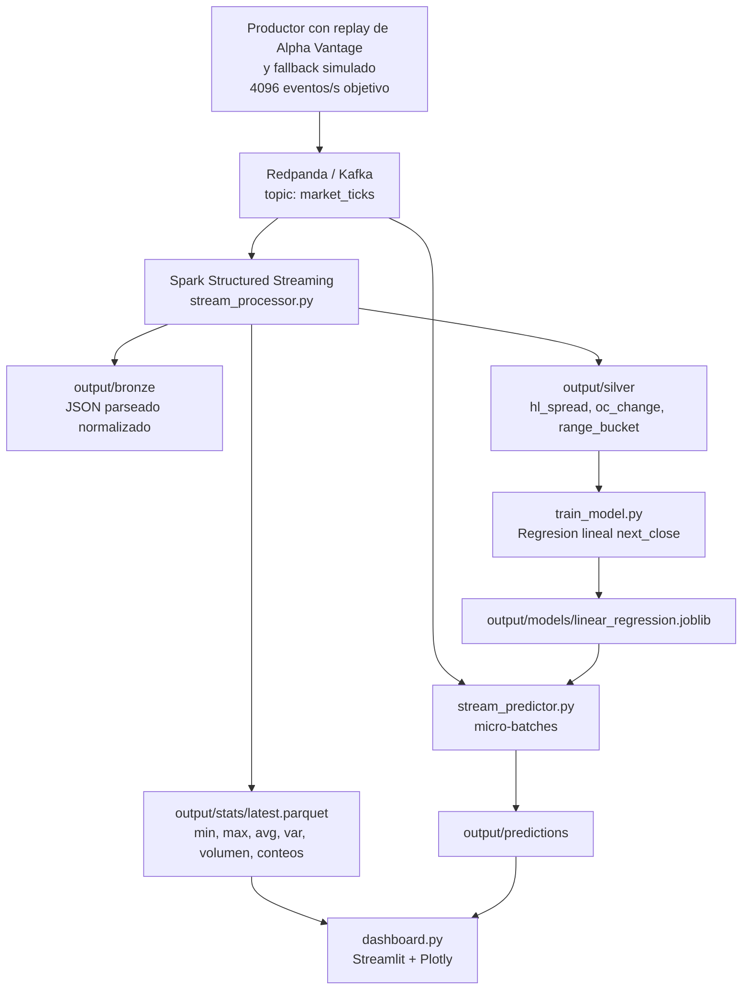
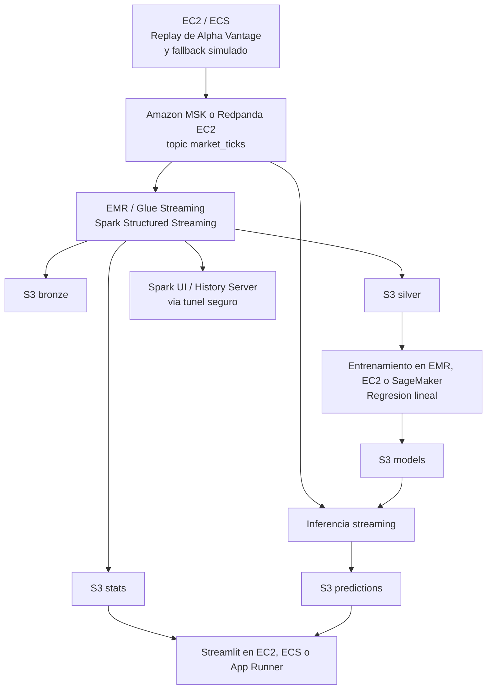

# Título y resumen

**Proyecto final: Arquitectura de Flujo Financiero en Tiempo Real** 

Implementaremos un flujo de datos financieros que tomará una primera secuencia de precios desde Alpha Vantage mediante su API key, la reproducirá con cadencia controlada en un topic Kafka compatible mediante Redpanda y, cuando esa secuencia se agote, continuará con datos simulados para mantener la continuidad del stream. Posteriormente, el pipeline procesará esos eventos con Spark para producir capas analíticas en Parquet, entrenará una regresión lineal sobre datos acumulados y aplicará inferencia a nuevos micro-lotes. La propuesta plantea una arquitectura local reproducible y comparable entre dos entornos de ejecución, con el fin de analizar portabilidad, observabilidad y comportamiento del pipeline sin depender de una sola máquina. 

# Breve introducción y justificación que además incluya los objetivos del proyecto

Con este proyecto buscaremos responder al objetivo académico de comparar arquitecturas para aplicaciones de datos en tiempo real usando Spark Structured Streaming y Kafka, con énfasis en captura continua, ventanas temporales, marcas de agua, persistencia de resultados y evaluación mediante Spark UI (Pereira González, s. f.). Elegiremos un dominio financiero porque los ticks de mercado son eventos naturalmente secuenciales, numéricos y aptos para visualizar mínimos, máximos, promedios, varianza y predicciones de precio.

Nuestro objetivo técnico será construir un pipeline completo: obtener una primera secuencia de eventos desde Alpha Vantage, reproducirla con cadencia alta en `market_ticks`, continuar con generación sintética cuando se terminen los registros disponibles, consumir el flujo con Spark, calcular estadísticas por ventana de 10 segundos, guardar capas `bronze`, `silver` y `stats`, entrenar un modelo supervisado simple y reactivar el flujo para predecir nuevos casos en streaming. Este objetivo se apoyará en los módulos `producer.py`, `stream_processor.py`, `train_model.py`, `stream_predictor.py` y `dashboard.py`, que nos permitirán separar captura, procesamiento, aprendizaje, inferencia y visualización.

La justificación arquitectónica será que Spark nos permitirá procesar micro-lotes con tolerancia a retrasos mediante watermark, Kafka desacoplará la producción de eventos del consumo analítico, y Streamlit facilitará la observación de resultados operativos sin depender únicamente de archivos. 

Compararemos dos arquitecturas de ejecución locales:
- Arquitectura en MacOS
  - Hardware de Emi
- Arquitectura en WSL2/Ubuntu
  - El pipeline se ejecuta en arquitectura x86_64
  - CPU AMD Ryzen 5 PRO 4650U with Radeon Graphics, 6 núcleos físicos y 12 lógicos.
  - Con 7.4 GiB de RAM disponibles para el entorno Linux.

# Obtención y método de captura de los datos

La captura operativa se planteará en dos etapas. Primero, extraeremos una secuencia de precios desde Alpha Vantage usando la credencial `ALPHAVANTAGE_API_KEY`, con el objetivo de contar con una base real de valores de mercado para el arranque del pipeline. Esa secuencia se publicará gradualmente como si llegara en tiempo real, respetando una cadencia controlada definida por `PRODUCER_RATE_PER_SECOND=4096`, equivalente a la magnitud mínima solicitada en las instrucciones del curso.

Cuando se agoten los registros obtenidos desde Alpha Vantage, el productor continuará con una extensión simulada para no interrumpir el flujo y para poder seguir probando ventanas, agregaciones, entrenamiento e inferencia bajo una carga constante. Cada evento conservará la misma estructura (`event_time`, `symbol`, `open`, `high`, `low`, `close`, `volume` y `source`), se serializará como JSON y se enviará a Kafka mediante `kafka-python-ng`, usando `acks="all"`, `linger_ms=50`, reintentos de conexión y `flush()` al cerrar cada lote por segundo. Además, la misma API key de Alpha Vantage se aprovechará como fuente auxiliar para completar datos históricos cuando se requiera fortalecer el conjunto de entrenamiento (Alpha Vantage, s. f.).

# Características del dashboard como les ayuda a definir el modelo de aprendizaje

El Dashboard Streamlit leerá `output/stats/latest.parquet`, `output/predictions` y `output/models/linear_regression.joblib`. Además, podrá integrar métricas de progreso del streaming y resultados de benchmarking cuando se generen para la comparación de arquitecturas. Presentará ventanas calculadas, predicciones generadas, MAE online, precio promedio por ventana, varianza por ventana, comparación `actual_next_close` contra `pred_next_close`, histograma de error absoluto y métricas operativas de ejecución (Streamlit, 2024).

Estas visualizaciones nos ayudarán a definir la utilidad del modelo porque mostrarán si la secuencia reproducida desde Alpha Vantage y su continuación simulada tienen variación suficiente, si las ventanas producen señales estables y si los errores de predicción justifican ajustar features o ventana temporal. Usaremos las variables `open`, `high`, `low`, `close`, `volume` y `hl_spread` para predecir `next_close` con regresión lineal; el dashboard nos permitirá contrastar la predicción contra el siguiente cierre observado y calcular el error absoluto medio en línea, una métrica directamente interpretable para decidir mejoras (Pedregosa et al., 2011).

# Explicación de la arquitectura y módulos de Spark y Kafka que utilizarán

Levantaremos la infraestructura local con `docker-compose.yml`: Redpanda expondrá un broker Kafka-compatible en `localhost:9092` y una consola web en `localhost:8080`. `app/config/settings.py` centralizará topic, broker, tasa del productor, ventanas, rutas de salida, `SPARK_MASTER=local[*]` y resolución automática del paquete `spark-sql-kafka-0-10` según versión de Spark y Scala; esta decisión evitará hardcodear el conector crítico entre Spark y Kafka (Apache Software Foundation, 2024; Redpanda Data, s. f.).

`app/pipeline/stream_processor.py` leerá Kafka con `startingOffsets="latest"`, parseará `value` con `MARKET_SCHEMA`, convertirá `event_time` a timestamp y aplicará watermark de 2 minutos. A partir de esa tabla streaming, escribirá `bronze` en modo append, construirá `silver` con `range_bucket`, `hl_spread = high - low` y `oc_change = close - open`, y calculará estadísticas por `window(event_time, 10 seconds, 10 seconds)` y `symbol`: `min_close`, `max_close`, `avg_close`, `var_close`, `avg_volume` y `n_obs`; el snapshot estable se guardará con `foreachBatch` como `output/stats/latest.parquet`.

El aprendizaje se ejecutará fuera del stream principal: `train_model.py` tomará `silver`, complementará con bootstrap si hay pocos registros, ordenará por símbolo y tiempo, definirá `next_close` con `shift(-1)`, dividirá 80/20, entrenará `LinearRegression` y persistirá modelo, features, target y métricas con `joblib`. Después, `stream_predictor.py` consumirá Kafka desde `startingOffsets="earliest"`, recalculará `hl_spread`, cargará el artefacto y aplicará inferencia por micro-lote con `foreachBatch`, escribiendo Parquet en `output/predictions`.

# ¿Qué les aporta la interfaz GUI de Spark?

La GUI de Spark en `http://localhost:4040` aportará observabilidad de ejecución para justificar la comparación de arquitecturas: mostrará jobs, stages, consultas Structured Streaming, tasas de entrada y procesamiento, duración de batches, uso de estado, planificación y comportamiento por etapa. Será especialmente útil porque el dashboard del proyecto podrá capturar parte de estas métricas, mientras que Spark UI permitirá revisar dimensiones adicionales como scheduler delay, executor run time, GC time, shuffle, spill e I/O por stage, que son las métricas exigidas para contrastar plataformas (Apache Software Foundation, 2024).

Durante las ejecuciones de prueba revisaremos métricas como `numInputRows`, `inputRowsPerSecond`, `processedRowsPerSecond`, `triggerExecution`, `memoryUsedBytes`, filas descartadas por watermark y cualquier señal de retraso acumulado o presión sobre el estado. Estos datos nos permitirán evaluar si el sistema procesa más rápido de lo que recibe y servirán como base para una comparación rigurosa entre dos arquitecturas con los mismos parámetros.

# Qué obtendrán y cuál es la utilidad de sus resultados

El resultado principal será un pipeline ejecutable que produzca datos crudos normalizados (`bronze`), datos enriquecidos para análisis y modelo (`silver`), estadísticas de ventana (`stats`), un artefacto de regresión lineal (`linear_regression.joblib`), predicciones en streaming (`predictions`) y métricas comparativas de ejecución. Su utilidad será demostrar, con evidencias reproducibles, cómo una arquitectura de grandes volúmenes separa ingestión, procesamiento, entrenamiento, inferencia y visualización sin acoplar todos los componentes en un solo proceso, incluso cuando combina una fuente inicial basada en Alpha Vantage con una continuación simulada controlada.

Desde el punto de vista analítico, los resultados nos permitirán observar estabilidad de la serie reproducida desde Alpha Vantage, comportamiento de la extensión simulada, latencia aproximada, throughput, error de predicción y sensibilidad a la plataforma de ejecución. Desde el punto de vista académico, nos permitirán cumplir la demostración de captura en tiempo real, cálculo frecuente de estadísticos, persistencia para entrenamiento supervisado, segunda tanda de streaming con predicción y base para comparar Spark local en diferentes arquitecturas locales.

# ¿Cómo implementarían el proyecto de usar AWS? Quien haya usado AWS ¿Cómo lo implementarían Google Colab?

Si se decidiera implementar el proyecto en AWS (lo cual no es nuestro plan), el productor podría ejecutarse en EC2 o ECS Fargate, Kafka podría reemplazarse por Amazon MSK o Redpanda autogestionado en EC2, Spark podría correr en EMR o AWS Glue Streaming, y las capas `bronze`, `silver`, `stats`, `models` y `predictions` podrían almacenarse en S3 con particionamiento por fecha y símbolo. El dashboard podría publicarse en EC2, ECS o App Runner, leyendo S3 y CloudWatch; Spark UI podría exponerse mediante túnel seguro o history server, y la comparación usaría las mismas métricas de input rate, processing rate, batch duration, shuffle, I/O, GC, spill y hardware.

En Google Colab, la opción viable sería usar Colab como ambiente de desarrollo, análisis y entrenamiento puntual, no como plataforma permanente de streaming, porque sus sesiones son efímeras. Colab podría conectarse a un broker Kafka externo y a almacenamiento como Google Drive o Cloud Storage, ejecutar PySpark local para pruebas pequeñas, entrenar el modelo con datos exportados y visualizar resultados; para una comparación justa se registrarían los mismos benchmarks y se documentaría la limitación de disponibilidad y red frente a AWS o ejecución local.

# Referencias bibliográficas

Apache Software Foundation. (2024). *Structured Streaming Programming Guide*. Apache Spark Documentation. https://spark.apache.org/docs/latest/structured-streaming-programming-guide.html

Apache Software Foundation. (2024). *Spark Structured Streaming + Kafka Integration Guide*. Apache Spark Documentation. https://spark.apache.org/docs/latest/structured-streaming-kafka-integration.html

Alpha Vantage. (s. f.). *Alpha Vantage API documentation*. https://www.alphavantage.co/documentation/

Apache Software Foundation. (s. f.). *Apache Kafka documentation*. https://kafka.apache.org/documentation/

Pedregosa, F., Varoquaux, G., Gramfort, A., Michel, V., Thirion, B., Grisel, O., Blondel, M., Prettenhofer, P., Weiss, R., Dubourg, V., Vanderplas, J., Passos, A., Cournapeau, D., Brucher, M., Perrot, M., & Duchesnay, É. (2011). Scikit-learn: Machine learning in Python. *Journal of Machine Learning Research, 12*, 2825-2830. https://jmlr.org/papers/v12/pedregosa11a.html

Pereira González, W. E. (s. f.). *Proyecto de Spark para comparar arquitecturas de ejecución en tiempo real* [Instrucciones de curso]. Instituto Tecnológico Autónomo de México.

Redpanda Data. (s. f.). *Redpanda documentation*. https://docs.redpanda.com/

Streamlit. (2024). *Streamlit documentation*. https://docs.streamlit.io/
