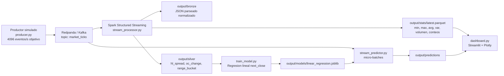
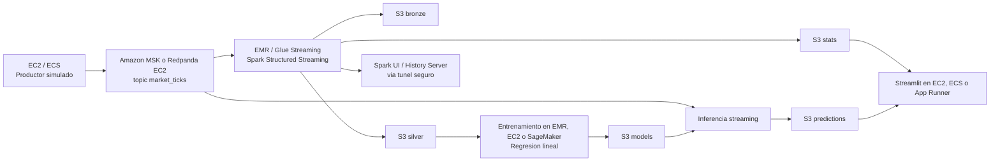

# Título y resumen

**Proyecto final: arquitectura de procesamiento en tiempo real con [[Spark Structured Streaming]], [[Kafka]], modelo supervisado y [[Dashboard Streamlit]].** El sistema implementa un flujo de datos financieros simulado que publica eventos en un topic Kafka compatible mediante [[Redpanda]], los procesa con Spark para producir capas analíticas en Parquet, entrena una [[Regresión lineal]] sobre datos acumulados y aplica inferencia a nuevos micro-lotes. El código confirma una arquitectura local reproducible, con evidencia de ejecución en `output/logs`: hardware macOS arm64 con 11 núcleos lógicos y 18 GB de RAM, benchmark local de entrenamiento y métricas de streaming con `inputRowsPerSecond` cercano a 3348.81 y `processedRowsPerSecond` cercano a 6437.07 en el snapshot disponible; este borrador se elaboró con apoyo de una consulta LLM documentada en referencias, validando las afirmaciones contra el código fuente (OpenAI, 2026).

# Breve introducción y justificación que además incluya los objetivos del proyecto

El proyecto responde al objetivo académico de comparar arquitecturas para aplicaciones de datos en tiempo real usando [[Spark Structured Streaming]] y [[Kafka]], con énfasis en captura continua, ventanas temporales, marcas de agua, persistencia de resultados y evaluación mediante Spark UI (Pereira González, s. f.). La implementación elige un dominio financiero porque los ticks de mercado son eventos naturalmente secuenciales, numéricos y aptos para visualizar mínimos, máximos, promedios, varianza y predicciones de precio.

El objetivo técnico es construir un pipeline completo: generar eventos con cadencia alta, publicarlos en `market_ticks`, consumirlos con Spark, calcular estadísticas por ventana de 10 segundos, guardar capas `bronze`, `silver` y `stats`, entrenar un modelo supervisado simple y reactivar el flujo para predecir nuevos casos en streaming. Este objetivo se materializa en los módulos `producer.py`, `stream_processor.py`, `train_model.py`, `stream_predictor.py` y `dashboard.py`, que separan captura, procesamiento, aprendizaje, inferencia y visualización.

La justificación arquitectónica es que Spark permite procesar micro-lotes con tolerancia a retrasos mediante watermark, Kafka desacopla la producción de eventos del consumo analítico, y Streamlit permite observar resultados operativos sin depender únicamente de archivos. La principal salvedad es que el requisito pide comparar dos arquitecturas de ejecución, mientras que los artefactos actuales contienen evidencia local y una plantilla para comparación A/B; por tanto, la segunda arquitectura debe completarse con la LA ARQUITECTURA DE EDU antes de la entrega final.

# Obtención y método de captura de los datos

La captura operativa es simulada: `app/pipeline/producer.py` genera eventos financieros con los campos `event_time`, `symbol`, `open`, `high`, `low`, `close`, `volume` y `source`. El precio sigue una caminata con deriva positiva pequeña y choque gaussiano, donde el nuevo cierre se calcula a partir del precio anterior, `drift = 0.02` y `shock ~ N(0, 0.35)`; después se derivan máximo, mínimo y volumen aleatorio. La cadencia objetivo está definida por `PRODUCER_RATE_PER_SECOND=4096`, equivalente a la magnitud mínima solicitada en las instrucciones, aunque el snapshot Spark disponible registra una tasa efectiva de entrada menor en esa ejecución.

El productor serializa cada evento como JSON y lo envía a [[Kafka]] mediante `kafka-python-ng`, usando `acks="all"`, `linger_ms=50`, reintentos de conexión y `flush()` al cerrar cada lote por segundo. Para el entrenamiento, si `output/silver` aún no contiene datos suficientes, `app/data/bootstrap_data.py` intenta construir un histórico diario desde Alpha Vantage mediante una clave configurada por variable de entorno; si no hay respuesta o credenciales válidas, usa un histórico sintético local, lo que mantiene la reproducibilidad sin exponer secretos (Alpha Vantage, s. f.).

# Características del dashboard como les ayuda a definir el modelo de aprendizaje

El [[Dashboard Streamlit]] lee `output/stats/latest.parquet`, `output/predictions`, `output/models/linear_regression.joblib`, `output/logs/hardware_profile.json`, `output/logs/benchmark_runs.csv` y `output/logs/stream_progress/stats_snapshot.json`. Presenta ventanas calculadas, predicciones generadas, MAE online, precio promedio por ventana, varianza por ventana, comparación `actual_next_close` contra `pred_next_close`, histograma de error absoluto, input rate, processing rate, duración de batch, memoria de estado y métricas de filas procesadas (Streamlit, 2024).

Estas visualizaciones ayudan a definir el modelo porque muestran si el precio simulado tiene variación suficiente, si las ventanas producen señales estables y si los errores de predicción justifican ajustar features o ventana temporal. El modelo real usa las variables `open`, `high`, `low`, `close`, `volume` y `hl_spread` para predecir `next_close` con regresión lineal; el dashboard permite contrastar la predicción contra el siguiente cierre observado y calcular el error absoluto medio en línea, una métrica directamente interpretable para decidir mejoras (Pedregosa et al., 2011).

# Explicación de la arquitectura y módulos de Spark y Kafka que utilizarán

La infraestructura local se levanta con `docker-compose.yml`: [[Redpanda]] expone un broker Kafka-compatible en `localhost:9092` y una consola web en `localhost:8080`. `app/config/settings.py` centraliza topic, broker, tasa del productor, ventanas, rutas de salida, `SPARK_MASTER=local[*]` y resolución automática del paquete `spark-sql-kafka-0-10` según versión de Spark y Scala; esta decisión evita hardcodear el conector crítico entre Spark y Kafka (Apache Software Foundation, 2024; Redpanda Data, s. f.).

`app/pipeline/stream_processor.py` lee Kafka con `startingOffsets="latest"`, parsea `value` con `MARKET_SCHEMA`, convierte `event_time` a timestamp y aplica watermark de 2 minutos. A partir de esa tabla streaming, escribe `bronze` en modo append, construye `silver` con `range_bucket`, `hl_spread = high - low` y `oc_change = close - open`, y calcula estadísticas por `window(event_time, 10 seconds, 10 seconds)` y `symbol`: `min_close`, `max_close`, `avg_close`, `var_close`, `avg_volume` y `n_obs`; el snapshot estable se guarda con `foreachBatch` como `output/stats/latest.parquet`.

El aprendizaje se ejecuta fuera del stream principal: `train_model.py` toma `silver`, complementa con bootstrap si hay pocos registros, ordena por símbolo y tiempo, define `next_close` con `shift(-1)`, divide 80/20, entrena `LinearRegression` y persiste modelo, features, target, MAE, RMSE, `n_train` y `n_test` con `joblib`. Después, `stream_predictor.py` consume Kafka desde `startingOffsets="earliest"`, recalcula `hl_spread`, carga el artefacto y aplica inferencia por micro-lote con `foreachBatch`, escribiendo Parquet en `output/predictions`.

# ¿Qué les aporta la interfaz GUI de Spark?

La GUI de Spark en `http://localhost:4040` aporta observabilidad de ejecución para justificar la comparación de arquitecturas: muestra jobs, stages, consultas Structured Streaming, tasas de entrada/procesamiento, duración de batches, uso de estado, planificación y comportamiento por etapa. Es especialmente útil porque el dashboard del proyecto ya captura parte de estas métricas en JSON, pero Spark UI permite revisar dimensiones adicionales como scheduler delay, executor run time, GC time, shuffle, spill e I/O por stage, que son las métricas exigidas para contrastar plataformas (Apache Software Foundation, 2024).

En la ejecución local registrada, el snapshot `stats_snapshot.json` reporta `numInputRows=2813`, `inputRowsPerSecond=3348.81`, `processedRowsPerSecond=6437.07`, `triggerExecution=437 ms`, `memoryUsedBytes=9488` y cero filas descartadas por watermark. Estos datos permiten evaluar si el sistema procesa más rápido de lo que recibe, si existe retraso acumulado y si el estado de ventana cabe en memoria; para una comparación rigurosa deben repetirse en una segunda arquitectura con los mismos parámetros.

# Qué obtendrán y cuál es la utilidad de sus resultados

El resultado principal será un pipeline ejecutable que produce datos crudos normalizados (`bronze`), datos enriquecidos para análisis y modelo (`silver`), estadísticas de ventana (`stats`), un artefacto de regresión lineal (`linear_regression.joblib`), predicciones en streaming (`predictions`) y métricas de hardware/benchmark. Su utilidad es demostrar, con evidencias reproducibles, cómo una arquitectura de grandes volúmenes separa ingestión, procesamiento, entrenamiento, inferencia y visualización sin acoplar todos los componentes en un solo proceso.

Desde el punto de vista analítico, los resultados permiten observar estabilidad de precios simulados, latencia aproximada, throughput, error de predicción y sensibilidad a la plataforma de ejecución. Desde el punto de vista académico, permiten cumplir la demostración de captura en tiempo real, cálculo frecuente de estadísticos, persistencia para entrenamiento supervisado, segunda tanda de streaming con predicción y base para comparar Spark local contra AWS o Google Colab.

# ¿Cómo implementarían el proyecto de usar AWS? Quien haya usado AWS ¿Cómo lo implementarían Google Colab?

En AWS, el productor podría ejecutarse en EC2 o ECS Fargate, Kafka se reemplazaría por Amazon MSK o Redpanda autogestionado en EC2, Spark correría en EMR o AWS Glue Streaming, y las capas `bronze`, `silver`, `stats`, `models` y `predictions` se almacenarían en S3 con particionamiento por fecha/símbolo. El dashboard se publicaría en EC2, ECS o App Runner, leyendo S3 y CloudWatch; Spark UI se expondría mediante túnel seguro o history server, y la comparación usaría las mismas métricas de input rate, processing rate, batch duration, shuffle, I/O, GC, spill y hardware.

En Google Colab, la opción viable sería usar Colab como ambiente de desarrollo, análisis y entrenamiento puntual, no como plataforma permanente de streaming, porque sus sesiones son efímeras. Colab podría conectarse a un broker Kafka externo y a almacenamiento como Google Drive o Cloud Storage, ejecutar PySpark local para pruebas pequeñas, entrenar el modelo con datos exportados y visualizar resultados; para una comparación justa se registrarían los mismos benchmarks y se documentaría la limitación de disponibilidad y red frente a AWS o ejecución local.

# Referencias bibliográficas

Apache Software Foundation. (2024). *Structured Streaming Programming Guide*. Apache Spark Documentation. https://spark.apache.org/docs/latest/structured-streaming-programming-guide.html

Apache Software Foundation. (2024). *Spark Structured Streaming + Kafka Integration Guide*. Apache Spark Documentation. https://spark.apache.org/docs/latest/structured-streaming-kafka-integration.html

Alpha Vantage. (s. f.). *Alpha Vantage API documentation*. https://www.alphavantage.co/documentation/

Apache Software Foundation. (s. f.). *Apache Kafka documentation*. https://kafka.apache.org/documentation/

OpenAI. (2026). *Consulta a ChatGPT para apoyo en documentación arquitectónica del proyecto* [Modelo de lenguaje grande]. [enlace a la conversación LLM]

Pedregosa, F., Varoquaux, G., Gramfort, A., Michel, V., Thirion, B., Grisel, O., Blondel, M., Prettenhofer, P., Weiss, R., Dubourg, V., Vanderplas, J., Passos, A., Cournapeau, D., Brucher, M., Perrot, M., & Duchesnay, É. (2011). Scikit-learn: Machine learning in Python. *Journal of Machine Learning Research, 12*, 2825-2830. https://jmlr.org/papers/v12/pedregosa11a.html

Pereira González, W. E. (s. f.). *Proyecto de Spark para comparar arquitecturas de ejecución en tiempo real* [Instrucciones de curso]. Instituto Tecnológico Autónomo de México.

Redpanda Data. (s. f.). *Redpanda documentation*. https://docs.redpanda.com/

Streamlit. (2024). *Streamlit documentation*. https://docs.streamlit.io/
